<h1 align="center">Hi there, I'm Muhammad Abubakar 👋</h1>
<h3 align="center">Full-Stack Developer | Python · Django · React · FastAPI · AI Integration · Cybersecurity</h3>

  

  
  
  
  

---

### 🚀 About Me

- 🎓 BS Information Technology — National University of Modern Languages (NUML), Islamabad (2026)
- 💼 Full-Stack AI Developer Intern @ **NCCS, Air University, Islamabad**
- 🧠 Built AI systems hitting **92% accuracy** across 5,000+ images and **95% precision** in forensic tampering detection
- 🛡️ Shipped **Intrusion Eye**, a live AI-powered web vulnerability scanner, and a commercial **POS Billing System** used in production
- ⚡ 35%+ backend performance improvements through query optimization and clean architecture
- 🌱 Currently deepening expertise in AI-integrated full-stack systems and cybersecurity tooling
- 📫 Reach me at **m.abubakar.prof@gmail.com**

---

### 🛠️ Tech Stack

  

<b>📦 Skills Breakdown</b>

 

**Languages & Backend**

**Frontend & Automation**

**Databases & DevOps**

**AI & Security**

---

### 📊 GitHub Stats

  
  

  

  

> ✅ Stats, top languages, streak, and activity are all generated by GitHub Actions and committed as static SVGs in this repo — no external server, no rate limits.

---

### 🏆 Impact Snapshot

| Metric | Result |
|---|---|
| Image analysis accuracy (Gemini API pipeline) | **92%** across 5,000+ images |
| Forensic tampering detection precision | **95%** across 1,000+ images |
| Backend query optimization | **35–40%** faster response times |
| API reliability (Auth & Account APIs) | **99.5% uptime**, 500+ requests |
| POS Billing System daily throughput | **500+ sales/day** in production |
| Vulnerability scanner (SQLi/XSS/CSRF) ML accuracy | **85%** |

---

### 💼 Featured Projects

<table>
<tr>
<td width="50%">

**🛡️ [Intrusion Eye — AI Web Vulnerability Scanner](https://github.com/Muhammad-Abubakar18)**
Final Year Project · Django · React · PostgreSQL · Celery · Redis · Gemini API

Full-stack scanner detecting SQLi, XSS, CSRF via ML payload classification (85% accuracy). Selenium + BeautifulSoup crawler, JWT auth with OTP, Gemini-powered chatbot, async Celery/Redis pipeline, ReportLab PDF reports.
🔗 Live: intrusioneye.vercel.app

</td>
<td width="50%">

**🧾 [POS Billing System](https://github.com/Muhammad-Abubakar18)**
C# · .NET · Entity Framework · WinForms

Commercial desktop billing platform delivered to a real client. Role-based auth, tiered admin dashboards, clean 3-tier architecture with custom validators and optimized repository patterns — handling 500+ daily sales.

</td>
</tr>
<tr>
<td width="50%">

**🔍 [Image Forensic & Sentiment Analysis](https://github.com/Muhammad-Abubakar18)**
FastAPI · React.js · Gemini API · ML

Full-stack AI pipeline processing 5,000+ images at 92% accuracy, with tampering detection at 95% precision and a real-time analytics dashboard.

</td>
<td width="50%">

**🚗 [Wheel and Deal — E-Commerce Vehicle Platform](https://github.com/Muhammad-Abubakar18)**
HTML5 · CSS3 · JavaScript · PHP · MySQL

Full-stack marketplace with 200+ dynamic listings, 1,000+ monthly transactions, and a 45% lift in user engagement.

</td>
</tr>
<tr>
<td width="50%" colspan="2">

**💊 [MedLo — Mobile Healthcare Application](https://github.com/Muhammad-Abubakar18)**
Java · Android SDK · SQLite · Firebase

Mobile app serving 500+ users with a 98% notification delivery rate, improving medication adherence by 30%.

</td>
</tr>
</table>

---

### 🎓 Education & Certifications

- 🎓 **BS Information Technology** — National University of Modern Languages (NUML), Islamabad · CGPA 3.08/4.0 · Graduated June 2026
- 📜 Python 101 for Data Science — IBM (2024)
- 📜 Data Science 101 — IBM (2024)
- 📜 JavaScript Fundamentals (2024)
- 📜 Python Basics (2023)
- 📜 Digital Marketing — Google Digital Garage (2022)

---

### ⚙️ One-Time Setup (fixes everything permanently)

<b>Click to see the setup steps</b>

 

1. **Create a Personal Access Token** — Settings → Developer settings → Personal access tokens → Tokens (classic) → Generate new token, with the `repo` scope checked.
2. **Add it as a repo secret** — In your profile repo, go to Settings → Secrets and variables → Actions → New repository secret → name it `STATS_PAT` → paste the token.
3. **Add three workflow files** to `.github/workflows/` in your profile repo:
   - `update-readme-stats.yml` — generates `profile/stats.svg`, `profile/top-langs.svg`, `profile/streak.svg` ✅ already working
   - `update-metrics.yml` — generates `profile/activity.svg` (replaces the old flaky contribution graph)
   - `snake.yml` — generates the animated contribution snake on a separate `output` branch
4. **Run each workflow once manually** — Actions tab → select each workflow → Run workflow. Check that each finishes with a green checkmark before moving to the next.
5. **Verify the files landed** — your repo should now contain a `profile/` folder with 4 SVGs, and (after the snake workflow runs) an `output` branch containing the snake SVG.

---

### 🐍 Contribution Snake

  

The workflow is provided as `snake.yml` — add it to `.github/workflows/` (see setup steps above), run it once, then it'll auto-update daily.

---

  

<i>⭐️ Open to full-stack, backend, and AI-integration roles — let's build something great.</i>

